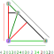

# decogen

P. Goetschalckx, K. Coolsaet, N. Van Cleemput. “Generation of Local Symmetry-Preserving Operations” (2019). arXiv: [1908.11622](https://arxiv.org/abs/1908.11622).

## Usage

```
decogen [-d] [-a] [-c 1|2|3] [-o OUTFILE] FACTOR

 -d,--decocode      write decocode to stdout or outfile
 -a,--all           generate decorations with smaller factors too
 -c,--connectivity  generate decorations with connectivity 1/2/3
 -o,--output        write to OUTFILE instead of stdout
 FACTOR             generate decorations with factor FACTOR (or smaller with -a)
```

## Output format (decocode)

The output is similar to [planarcode](https://users.cecs.anu.edu.au/~bdm/plantri/plantri-guide.txt).
It starts with the header `>>deco_code<<`, followed by a sequence of byte-encoded decorations.

```
Format: "{planarcode}{kind}{edge}{border}"

{planarcode}: planarcode of edges of type 1

{kind}: 1 byte, describing the situation in v1
 0: the vertex has type 1, and degree 2
    the edge on side 0 has type 0
 1: vertex has type 1, and degree 2
    the edge on side 0 has type 2
 2: the vertex has type 2
 3: the vertex has type 0

{edge}: 2 bytes, giving the vertices a and b
   kind 0/1      kind 2/3
     a             *
     | `           | `
     *---b         a---b

{border}: describes the types of edges on the border
 direction: v1 -> v2 -> v0 -> v1
 1: edge of type 1
 2: two edges of type 0 or 2
 0: v0/v1/v2
```

### Examples

| truncate                  | chamfer                 |
|:-------------------------:|:-----------------------:|
|  |  |
